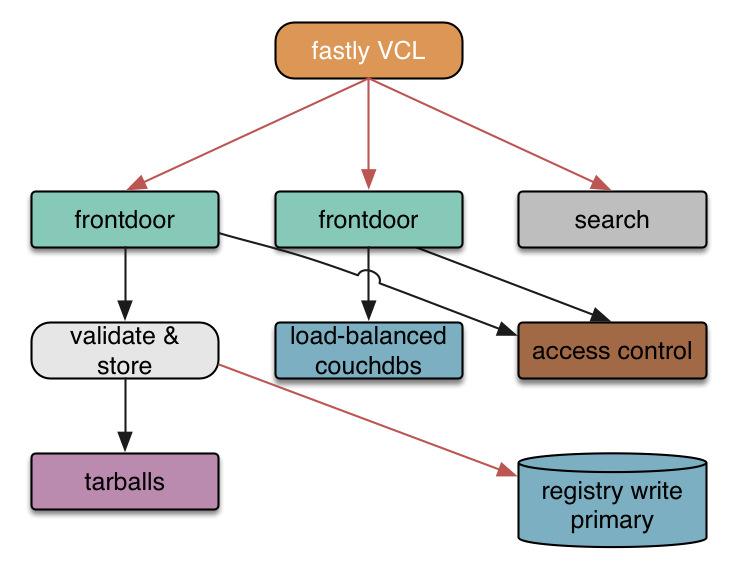
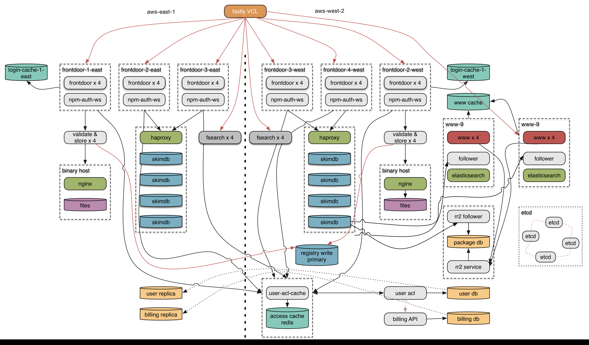

build-lists: true
# [fit] npm registry 2.0
# [fit] deep-dive

---

# [fit] C J Silverio
## [fit] director of engineering, npm
## [fit] @ceejbot

^ In case you forgot who I am: this is who I am this year. Next year I might be somebody else. YNK.

---

^ Here's where the registry started. A node command-line tool plus an app embedded in couchdb.

---

# [fit] registry 1.0
# [fit] embedded in couchdb

---

# [fit] javascript
# [fit] but not node
# [fit] the shame, the shame

^ some support systems written in node. what's more, this was a really tangled piece of js. Not modular in any way.

---

# advantages

* hey! it was a simple working system
* couchdb's replication made mirrors easy
* didn't have to implement auth
* got away with storing package tarballs as couch attachments
* worked for a longer time than we deserved

---

# disadvantages

* all of this fell over at scale
* tarballs fell over first
* we aren't erlang experts
* not modular; hard to work on

^ Base64-encoded binary blobs. Observability. Couch has a module system, but it isn't npm.  

---

# late 2013: stay up

* pulled out tarballs into Joyent Manta
* put varnish in front of everything
* fastly CDN for geolocality

---

# early 2014: stability

* tarballs onto a file system
* found & stomped problems with our couchdb installation
* load-balanced everything

^ This was stable enough that 2014 became the year that node exploded. Node wasn't changing; npm worked. You all started using node to do front end development as well as the back end.

---

# [fit] now we're stable!
# [fit] npm's next goal:
# [fit] be self-sustaining

^ To do this, we needed to start adding features that people want to pay for. To do that, we needed to be able to change how the registry worked.

---

# end 2014: rewrite

* a use for our node expertise
* microservices: node's natural architecture
* future scaling
* ability to add features easily
* scoped modules!

^ In order to have money coming in, we needed to make something worth paying for. we needed to start adding features Adding those features to the app embedded in couch was a non-starter

---

# scoped modules

Namespaces! Everybody can make public scoped modules.

* `request`: the famous module
* `@mikeal/request`: super-hip fork
* `@ceejbot/request`: my completely unrelated module

$7/month and you can create private scoped modules.

---

# team

* 3 engineers on the registry & operations
* 2 engineers on the website
* 2 engineers on the command-line client

^ I soaked up most of the operations work during the main project. The CLI is in the middle of its own massive rewrite project.

---

# [fit] shipped the core of it
# [fit] as npm-enterprise
# [fit] "npm in a box" service

^ This is the rewrite minus some supporting features & with a different auth model.

---

# [fit] had a working registry in node
# [fit] before we migrated the
# [fit] public registry to it

^ This was a great move, because we had a chance to stomp the big bugs long before we even considered moving the main registry over.

---

# [fit] April 2015
# [fit] registry 2.0 in production

^ I teased this on twitter periodically. I would announce that "you're soaking in it" when new registry was live.

---

# [fit] turning on scoped modules
# [fit] was flipping a feature switch

^ This is how you want it to be.

---

# [fit] 150,000 modules
# [fit] ~400GB tarballs
# [fit] 68 million dls/day peak
# [fit] 5800 req/sec peak

^ We have great cache hit rates with Fastly. (Package tarballs very cacheable!) Lots of 304s.

---

# [fit] registry 2.0:
# [fit] node microservices

^ Now we start diving into details. I love hearing about the details of other companies' stacks, so I'm sharing now in the hopes that you share too. You ready?

---

# the stack (top)

* Fastly as our CDN (faster in Europe!)
* AWS EC2
* we do *not* use EBS or other AWS-specific techs
* Ubuntu Trusty
* nagios + PagerDuty
* Github hosts our code

^ Amazon! Everybody uses it. it's cheap. It give us lots of control. Ubuntu is the least annoying of the linux distros. I'd pick debian if it didn't exist. Mostly DC redundant, with all single pts of failure in us-west-2.

---

# the stack (middle)

* haproxy for load balancing & tls termination
* a couple instances of pound for tls (legacy)
* nginx for static files
* redis for caching

^ Phasing pound out. Love the other three.

---

# the databases

* couchdb for package data storage
* postgres for users, billing, access control lists
* replica of the package data in postgres to drive website

^ The downloads service uses mysql, but we'll be rewriting that. Couchdb replicates. postgres: ad-hoc querying is nice, but replication is a mess.

---

# big node modules

* web site only: hapi
* everything else: restify
* knex to help with postgres

^ The public downloads service is hapi, but we'll rewrite that when we get around to making it perform well.

---

# restify

* barely a framework
* trivial to get a json api running
* observable
* sinatra/express routing
* we like the connect middleware style

---

# conventions across services

* monitoring endpoints same for all
* every process has a repl
* json logging
* config mostly through cmd-line arguments
* some environment variable passing

---

# configuration via etcd

## https://github.com/coreos/etcd

A highly available key/value store intended for config & service discovery. We recursively store & extract json blobs from it using `renv`.

`ndm` tool transforms json into command-line options in an upstart script.

^ How we do configuration. Renv is cool: can merge config so staging & production can share. The config ends up on disk on each server so we don't need the db up to restart. Only to change & push config out to each box.

---

# [fit] automation via ansible

## [fit] any box can be replaced
## [fit] by running an ansible play

^ We love ansible. Don't care what automation system you use, just USE ONE. No special snowflakes

---

# [fit] brace yourselves
# [fit] diagrams incoming

^ Brief tour of topology.

---

^ Here's a pretty handwave-y block diagram of the registry. Each of these pieces is a scalable unit.

---

^ Hey look, I just made most of my system redundant across AWS, just by replicating the logical modules.

---

^ Here's what it looks like in detail. Made this diagram for myself to keep track of everything; some things are missing. For instance, we have a staging environment.

---

# lots of complexity, but

* each piece has a well-defined responsibility
* each piece can be redundant
* exceptions: db write primaries
* each service can be worked on in isolation

---

# downsides

* yay distributed systems
* backpressure isn't handled well
* some single points of failure: db primaries
* metrics are a work in progress
* everything is hand-rolled

^ We rehearse the firedrill of replacing primaries. We also rehearse restoring from backup.

---

# conservatism won with node

* we're mostly on node 0.10.38
* memory leaks, some networking trouble with early iojs
* will try again with iojs 1.8.x
* or with node now that iojs took over :)

---

# git deploy

Ansible to set it up once. Git to deploy. (Not the @mafintosh future!)

`git push origin +master:deploy-production`
`git push origin +master:deploy-staging`

That's it. You've deployed.

---

# A git-deployable service

- haproxy load-balancing & monitoring
- webhooks server
- github webhooks trigger a bash script
- any server can have many apps git-deployed to it
- generally 1 process per core

---

# open sourced parts

* [jthooks](https://github.com/ceejbot/jthooks): set up github web hooks from the command line
* [jthoober](https://github.com/ceejbot/jthoober): a server that listens for webhook pushes from github & runs scripts in response
* [rderby](https://github.com/npm/rderby): rolling restarts for servers behind haproxy
* [renv](https://github.com/bcoe/renv): recursively manages json blobs with `etcd`.
* [ndm](https://github.com/npm/ndm): generate upstart/whatever scripts from a service.json config

---

# metrics

All open-source. InfluxDB ➜ Grafana for dashboards.

* [numbat-emitter](https://github.com/ceejbot/numbat-emitter) - client to emit metrics from any node service
* [numbat-collector](https://github.com/ceejbot/numbat-collector) - service to collect & redirect to many outputs

^ Not happy with this system yet-- easy to overwhelm our influx setup with too much data.

---

# future work

* organizations for private modules! already in progress
* make web site search a lot better
* make the relational package data available via public api
* more public replication points (all public packages, including scoped)

---

# [fit] npm loves you
# [fit] `npm install -g npm@latest`

^ Please update your command-line client!
