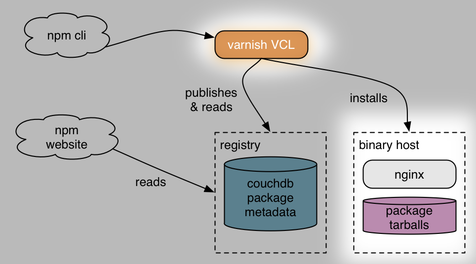

build-lists: true

# [fit] Cheating Gall's Law

---

## [fit] How we split
# [fit] a monolith
## [fit] and lived to tell the tale

---

# [fit] C J Silverio
## [fit] director of engineering, npm
## [fit] @ceejbot

^ Working at npm is a privilege.

---

# [fit] Gall's Law

# [fit] A complex system that works is
# [fit] invariably found to have evolved
# [fit] from a simple system that worked.

^ Introduce the law. Hold onto this thought.

---

^ npm like a lot of systems was originally very simple. The registry was a few thousand lines of javascript embedded inside CouchDB. Auth was couch's auth.

---

^ That is the very definition of a monolith.

---

# [fit] monolith
# [fit] everything in one process

---

# [fit] monoliths
# [fit] work just fine

---

# [fit] whatever it takes
# [fit] to get to your
# [fit] simple working system

^ It's far harder to make something that delights your users and is a viable product than it is to scale something after the fact. This is what npm did.

---

# [fit] Exponential growth of node
# [fit] resulted in exponential growth
# [fit] of the npm registry

---

# [fit] scaling monoliths
# [fit] many copies of the full thing

^ After a while this becomes expensive. Your monolith is probably expensive.

---

# [fit] Time to split it!
# [fit] yay microservices

^ but there's a catch

---

# [fit] Your monolith is complex.
# [fit] A split system is complex.

---

# [fit] Gall's Law
# [fit] is in our way

^ A complex system that works is invariably found to have evolved from a simple system that worked.

---

*Systemantics: How Systems Really Work and How They Fail*

John Gall

^ who the dude was

---

# Gall's Law

> A complex system that works is invariably found to have evolved from a simple system that worked. A complex system designed from scratch never works and cannot be patched up to make it work. You have to start over with a working simple system.

^ A complex system that works is invariably found to have evolved from a simple system that worked. A complex system designed from scratch never works and cannot be patched up to make it work. You have to start over with a working simple system.

---

> A simple system may or may not work.

^ We have some advantages here. We know what a working system looks like.

---

# [fit] Q: How do you cheat?

---

# [fit] Q: How do you cheat?
# [fit] A: With a proxy.

---

# [fit] rewrite piece by piece
# [fit] proxy to the new pieces

---

^ Varnish as a proxy: tarball reads go to nginx. Package metadata reads & writes go to couchdb. This simple technique was our first step to breaking up the monolith.

---

# [fit] Replace Varnish
# [fit] with a node service

---

^ We called it the registry frontdoor, because all traffic goes through it.

---

# [fit] just send everything through

^ Great time to measure.

---

# [fit] start pulling pieces out
# [fit] and sending them to new services

---

^ Authorization & package validation are now pulled out of couch into services.

---

# [fit] each service is simple
# [fit] one concern per service

---

# [fit] stay micro

---

# [fit] now you can change
# [fit] everything

---

# [fit] your database

---

# [fit] modularity!
# [fit] implementation is hidden!

---

---

# [fit] Microservices &
# [fit] single-purpose databases.

---

^ The registry looks like this now.

---

# [fit] Nobody noticed this change.

^ 120 seconds of downtime during the rollout thanks to a surprise merge.

---

# [fit] Advantages

---

# [fit] Everything is now observable.
# [fit] Each piece is simple.

---

# [fit] modularity
# [fit] each piece hides implementation

---

# [fit] pitfalls

^ discuss pitfalls

---

> I see you have a poorly structured monolith. Would you like me to convert it into a poorly structured set of microservices?

-- @architectclippy

---

# [fit] faithfully preserve your mistakes!

^ We have done a bunch of this.

---

# [fit] Second system syndrome
# [fit] tempting to generalize

^  don't do it!

---

# [fit] Generalize only when forced

---

# [fit] Lessons learned

---

# [fit] simple first
# [fit] complex later

---

# [fit] build your working system first
# [fit] scale it later

^ Don't be ridiculous about scaling, but don't worry about it.

---

# [fit] npm loves you
