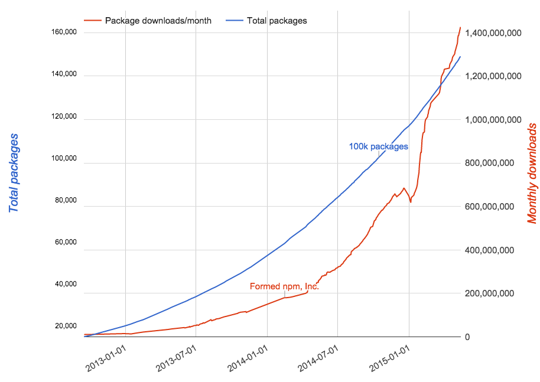
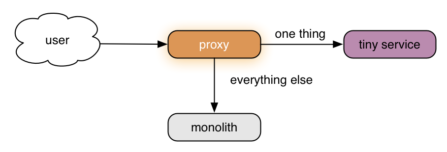
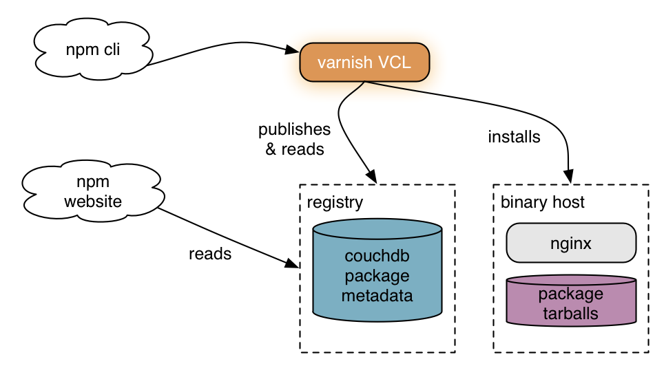
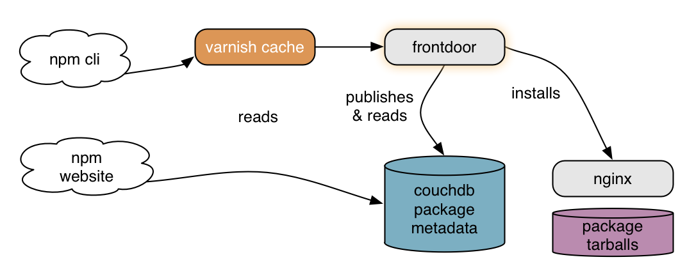
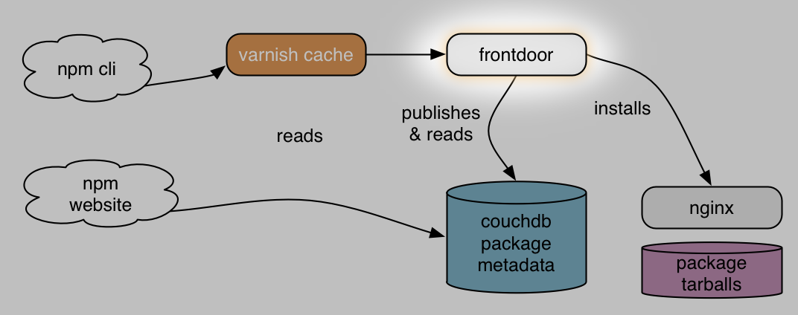
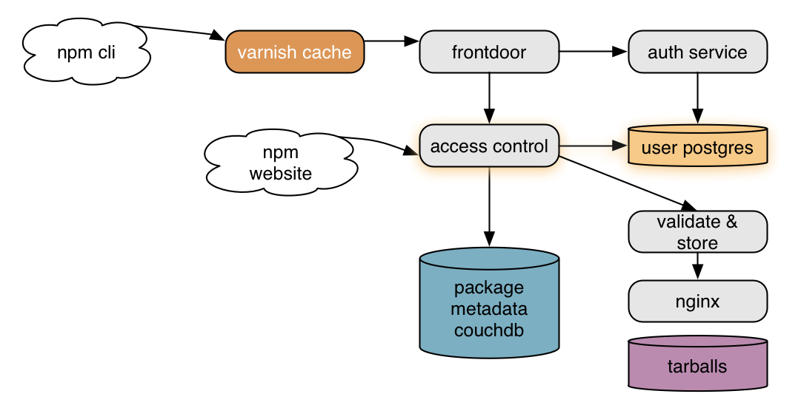
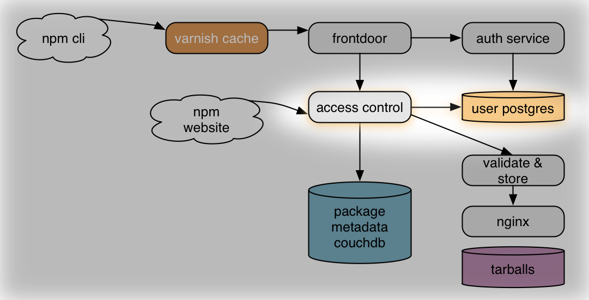
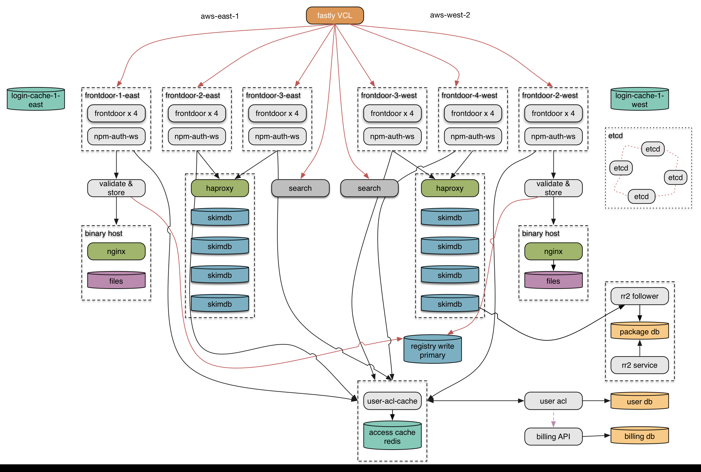

build-lists: true

# [fit] Cheating Gall's Law

---

# [fit] C J Silverio
## [fit] director of engineering, npm
## [fit] @ceejbot

^ Working at npm is a privilege.

---

# [fit] Cheating Gall's Law
## [fit] How we split
# [fit] a monolith
## [fit] and lived to tell the tale

---

^ What's a monolith?

---

# [fit] monolith
# [fit] everything in one process

---

^ npm like a lot of systems was originally very simple. The registry was a few thousand lines of javascript embedded inside CouchDB. Auth was couch's auth.

---

# [fit] npm's monolith:
# [fit] embedded in couchdb

^ The npm registry was x thousand lines of js embedded in couchdb.

---

# [fit] monoliths
# [fit] work just fine

^ The registry was just fine as a couch app, using couch auth.

---

# [fit] whatever it takes
# [fit] to build a system
# [fit] that satisfies your users

^ It's far harder to make something that delights your users and is a viable product than it is to scale something after the fact. This is what npm did.

---

# [fit] success!
# [fit] now scale it.

^ What happens next is that you succeed.

---

^ You're gonna need more monoliths.

---

# [fit] scaling monoliths
# [fit] many copies of the full thing

^ After a while this becomes expensive. Your monolith is probably expensive. And sometimes you get exponential growth.

---

^ Blue line packages. Red line monthly downloads. Joined at 200M/month. Now it's 1.4 billion/month.

---

# [fit] Exponential growth of node
# [fit] resulted in exponential growth
# [fit] of the npm registry

^ Eventually we needed to break out of that single app embedded inside couchdb. had to scale another way

---

# [fit] splitting the
# [fit] monolith

^ Eventually you need to scale differently: you break up the monolith..

---

# [fit] yay microservices?

^ This is what everybody says. Not going to bludgeon you with yet another discussion of microservices & why you want them. Let's suppose you've decided to split things up.

---

# [fit] Your monolith is complex.
# [fit] A split system is more complex.

^ Complexity is the enemy of everything.

---

# [fit] Gall's Law

# [fit] A complex system that works is
# [fit] invariably found to have evolved
# [fit] from a simple system that worked.

^ A complex system that works is invariably found to have evolved from a simple system that worked.

---

# [fit] Systemantics:
# [fit] How Systems Really Work
# [fit] and How They Fail

^ John Gall: a pediatrician, not a computer scientist. Interested in systems theory.

---

# Gall's Law

> A complex system that works is invariably found to have evolved from a simple system that worked. A complex system designed from scratch never works and cannot be patched up to make it work. You have to start over with a working simple system.

^ A complex system that works is invariably found to have evolved from a simple system that worked. A complex system designed from scratch never works and cannot be patched up to make it work. You have to start over with a working simple system.

---

# [fit] "A simple system
# [fit] may or may not work."

^ That's really encouraging. Gall is just a bundle of fun here. But he's saying things we all already suspect.

---

# [fit] Gall's Law
# [fit] says we can't write our
# [fit] complex replacement

^ The system we need to replicate is complicated. We can't just build it from scratch. We have some advantages here. We know what a working system looks like.

---

# [fit] how do you split
# [fit] a monolith
# [fit] successfully?

---

# [fit] Let's cheat.

^ I promised you we'd be cheating. You can't break the law, no matter how tempted you are to argue with it. You have to write simple working systems first.

---

# [fit] Q: How do you cheat?
# [fit] A: By not rewriting the whole thing.

^ There are a lot of options here. I'm going to tell you the one npm took, because it's a networked service. If you're writing web services, this might work for you.

---

# [fit] Q: But how, CJ?
# [fit] A: With a proxy.

^ Proxies let you divide & conquer.

---

# [fit] rewrite piece by piece
# [fit] proxy to the new pieces

^ Don't rewrite the whole thing. Rewrite a simple piece.

---

^ Let's look at an example.

---

^ Here's npm's monolith pre-split. Now what what we do.

---

---

^ Varnish as a proxy: tarball reads go to nginx. Package metadata reads & writes go to couchdb. This simple technique was our first step to breaking up the monolith. This one change relieved about 90% of our couchdb performance problems.

---

# [fit] Replace Varnish
# [fit] with a node service

^ You can put some logic into Varnish, but get a lot more mileage out of proxying at the application level. Way more control.

---

---

^ We called it the registry frontdoor, because all traffic goes through it.

---

# [fit] just send everything through

^ Great time to measure. Metrics, logging, everything!

---

# [fit] record what the proxy does
# [fit] how do people use your service?
# [fit] discover its true behavior

^ For us, this was also a chance to find out what people were actually doing with the registry & how long each operation took. Find the hot spots.

---

# [fit] start pulling pieces out
# [fit] and sending them to new services

^ Once you know where the hot spots are, or identify a chunk you can understand pull it out.

---

---

^ Authorization & package validation are now pulled out of couch into services.

---

# [fit] each service is simple
# [fit] one concern each

^ Gall's Law is still in force. We still must write simple things & build from there. In this case, the new simple system is the new service. The existing system is a tiny bit more complicated.

---

# [fit] modularity
# [fit] aka information hiding

^ You think about this at the code level, but here we're doing it at the service level. The implemention of each module is hidden behind the API of the service.

---

# [fit] now you can change
# [fit] everything

^ I told you I wasn't going to sell microservices, but I'm selling them. This is for me the neatest part.

---

# [fit] your platform
# [fit] your database

^ We went from js inside couchdb to js in node services. We also pulled data out of couchdb onto the file system and into postgres.

---

---

---

# [fit] Microservices &
# [fit] single-purpose databases.

---

^ Here's a pretty handwave-y block diagram of the registry. Each of these pieces is a scalable unit.

---

^ Hey look, I just made most of my system redundant across AWS, just by replicating the logical modules.

---

^ The real system diagram looks like this, but most of the time I don't need to think about it at this level. (If you want the details here, come to NodeConf OneShot on Saturday.)

---

# [fit] the awesome

---

# [fit] Each piece is simple

^ More easily debugged & understood.

---

# [fit] faithfully preserved
# [fit] your mistakes?
# [fit] NOT A PROBLEM.

^ You might not understand your service & how your users depend on it! What you think of as a bug might be a critical part of somebody's workflow. (Search)

---

# [fit] more scaling dials to turn
# [fit] finer-grained perf data

^ Metrics & logging. Can scale by multiplication of a smaller piece. For us this was a huge win. SEARCH. CouchDB was sweating.

---

# [fit] modularity
# [fit] each piece hides implementation

^ Can change the user database without the rest of the system caring.

---

# [fit] the pitfalls

^ There's always a tradeoff. Nothing ever comes free.

---

# [fit] now you've got a
# [fit] distributed system

^ You had one before but mostly you pretended you didn't because the hard parts were handled by somebody else. Now you have one that's entirely your responsibilty. We had race conditions. We're still not handling backpressure everywhere we need to.

---

# @architectclippy says

> I see you have a poorly structured monolith. Would you like me to convert it into a poorly structured set of microservices?

^ Cannot save you from poor decisions about modularity.

---

# [fit] faithfully preserved
# [fit] your mistakes?
# [fit] problem.

^ SEARCH as example. We split it off by routing it to dedicated Couchdbs, then found out that this is where our couchdb scaling problem had been.

---

# [fit] Second system syndrome
# [fit] "this time we'll do it right"

^ Doing it right usually means generalizing EVERYTHING because you just went through the pain of adding generalization here & there to a system that wasn't designed for it. Don't do it!

---

# [fit] Generalize only when forced

^ Even when you remember the pain you experienced generalizing that first system. Do it only when you must. Avoid complexity that doesn't pay for itself.

---

# [fit] what do I want you to take away?

---

# [fit] build your working system first
# [fit] scale it later

^ Don't be ridiculous about scaling, but don't worry about it. You'll be able to afford it later if you've built something people want.

---

# [fit] simple first
# [fit] complex later

^ Be ruthless about this.

---

# [fit] Be bold.
# [fit] you can change your system.

^ I cannot help you with the politics, but I can tell you that you don't have to be afraid. You can change one small piece of a system at a time. This approach works.

---

# [fit] Nobody noticed
# [fit] when we changed
# [fit] the entire npm registry.

^ 120 seconds of downtime during the rollout thanks to a surprise merge. I'm a schlub. If I can do it, you can do it.

---

# [fit] proxies are cool.
# [fit] I'm into proxies now.

^ Put a proxy on it. A proxy will let you divide & conquer.

---

# [fit] npm loves you
